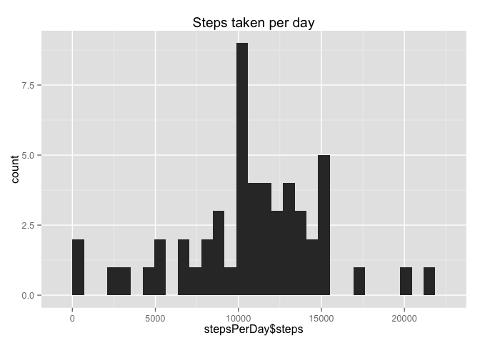
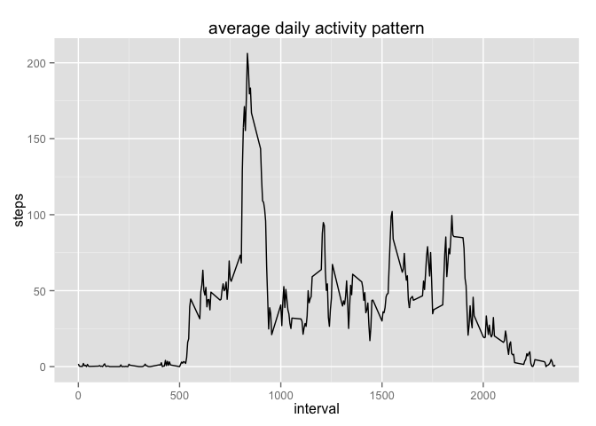
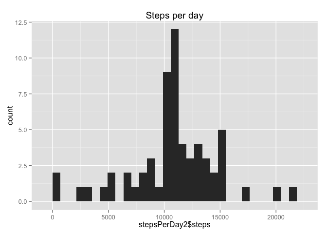
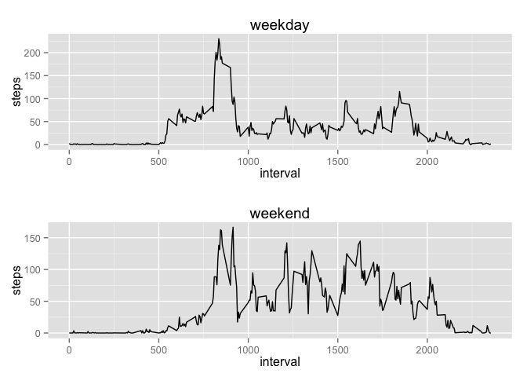

# Reproducible Research: Peer Assessment 1
Andrew E. Davidson  
Sep 15, 2015  


## The data
The variables included in this dataset are:

steps: Number of steps taking in a 5-minute interval (missing values are coded as NA)

date: The date on which the measurement was taken in YYYY-MM-DD format

interval: Identifier for the 5-minute interval in which measurement was taken

## Loading and preprocessing the data
1. Load the data (i.e. read.csv())

The github repo we forked from contains the data file activity.zip. 
The following code will automatically unzip the data file into a subdirectory
if needed. In general to save space we do not want to store the unzipped version 
of the data in git.


```r
dataDir <- "./data/"
dataFile <- sprintf("%s%s", dataDir, "activity.csv")
if (!file.exists(dataDir)) { dir.create(dataDir)}
if (!file.exists(dataFile)) {
  unzip("activity.zip", exdir=dataDir)
  dateDownLoaded <- date()
  write(dateDownLoaded, file=sprintf("%s%s", dataDir, "dateDownLoaded.txt"))
}
data <- read.csv(dataFile, header=TRUE)
```

2. Process/transform the data (if necessary) into a format suitable for your analysis

By default read.csv treats the data column as string
factors. We use as.Date() to convert factors to type date

```r
data[[2]] <- as.Date(data[[2]])
```

Check to see if any of the fields are missing (For this part of the assignment we can ignore the missing values in the dataset. Also check if data is ordered by date
)

```r
sum(is.na(data$steps))
```

```
## [1] 2304
```

```r
sum(is.na(data$date))
```

```
## [1] 0
```

```r
sum(is.na(data$interval))
```

```
## [1] 0
```

```r
is.unsorted(data$date)
```

```
## [1] FALSE
```

Explore the interval data

```r
numIntervalsInDay <- (24 * 60) / 5
numUniqueIntervalsInData <- length(unique(data$interval))
rangeOfInterval <- range(data$interval)
```
there are 288 5 min. intervals in any gvien day. Our data
contains 288 differnt intervals. The range of interval
value is 0, 2355. By visually inspecting the interval values I think
the values are actually some sort of time stamp. I.E. 2355 is military time for 
11:55 pm. We should be able to treat the interval data like a factor

## What is mean total number of steps taken per day?

1. Make a histogram of the total number of steps taken each day

```r
stepsPerDay <- aggregate(steps ~ date, data=data, FUN=sum)
library(ggplot2)
qplot(stepsPerDay$steps, geom="histogram") + ggtitle("Steps taken per day")
```

```
## stat_bin: binwidth defaulted to range/30. Use 'binwidth = x' to adjust this.
```

 

2. Calculate the mean and median number of steps per day ps taken each date

```r
averageStepsPerDay <- round(mean(stepsPerDay$steps), digits=2)
medianStepsPerDay <- median(stepsPerDay$steps)
```
The mean number of steps taken each day is 10766.19.
The median number of steps taken each day is 10765


## What is the average daily activity pattern?

1. Make a time series plot (i.e. type = "l") of the 5-minute interval (x-axis) and the average number of steps taken, averaged across all days (y-axis)

```r
averageStepsByInterval <- aggregate(steps ~ interval, data=data, FUN=mean)
p <- ggplot(data=averageStepsByInterval, aes(x=interval, y=steps, group=1))
p + geom_line() + ggtitle("average daily activity pattern")
```

 

2. Which 5-minute interval, on average across all the days in the dataset, contains the maximum number of steps?

```r
m <- max(averageStepsByInterval$steps)
r <- averageStepsByInterval[averageStepsByInterval$steps==m,]
intervalWithMostNumSteps <- r$interval
```
The interval with the most number of steps is 835

## Imputing missing values
1. Calculate and report the total number of missing values in the dataset (i.e. the total number of rows with NAs)

```r
numMissingSteps <- sum(is.na(data$steps))
numMissingDates <- sum(is.na(data$date))
numMissingInterval <- sum(is.na(data$interval))
#data[is.na(data)] <- 0
```
The number of rows missing step data is 2304

The number of rows missing date data is 0

The number of rows missing interval data is 0

2. Devise a strategy for filling in all of the missing values in the dataset. 
The strategy does not need to be sophisticated. For example, you could use the 
mean/median for that day, or the mean for that 5-minute interval, etc.

My stratey is to loop over all rows in the data frame. If the number of steps
is NA, assign the average number of steps for that interval

3. Create a new dataset that is equal to the original dataset but with the 
missing data filled in.

```r
fixedData <- read.csv(dataFile, header=TRUE)
fixedData[[2]] <- as.Date(fixedData[[2]])
n <- nrow(data)
for (i in 1:n) {
    if (is.na(fixedData[i,1])) {
        interval <- fixedData[i,3]
        x <- averageStepsByInterval[averageStepsByInterval$interval == interval,]$steps
        # we want to round, steps are ints not reals
        r <- round(x)
        fixedData[i,1] <- r
        #cat('interval:', interval, " x:", x, " r:", r, " new:", fixedData[i,1], "\n")
    }
}

sum(is.na(fixedData$steps))
```

```
## [1] 0
```

```r
sum(is.na(fixedData$date))
```

```
## [1] 0
```

```r
sum(is.na(fixedData$interval))
```

```
## [1] 0
```

4. Make a histogram of the total number of steps taken each day and Calculate 
and report the mean and median total number of steps taken per day. Do these 
values differ from the estimates from the first part of the assignment? 
What is the impact of imputing missing data on the estimates of the total daily 
number of steps?


```r
stepsPerDay2 <- aggregate(steps ~ date, data=fixedData, FUN=sum)

library(ggplot2)
qplot(stepsPerDay2$steps, geom="histogram") + ggtitle("Steps per day")
```

```
## stat_bin: binwidth defaulted to range/30. Use 'binwidth = x' to adjust this.
```

 

```r
averageStepsPerDay2 <- round(mean(stepsPerDay2$steps), digits=2)
medianStepsPerDay2 <- median(stepsPerDay2$steps)
```
The original mean number of steps taken each day is 10766.19.
The orginal median number of steps taken each day is 10765

After replacing missing step data with the average number of steps for the 
interval

The mean number of steps taken each day is 10765.64.
The median number of steps taken each day is 10762

So fixing the data had a small over all effect.

## Are there differences in activity patterns between weekdays and weekends?

1. Create a new factor variable in the dataset with two levels – “weekday” and 
“weekend” indicating whether a given date is a weekday or weekend day.


```r
w <- weekdays(fixedData$date) 
weekEnds <- w == "Saturday" | w == "Sunday"
#weekDays <- !weekEnds
dayType <- ifelse(weekEnds, "weekEnd", "weekDay")
fixedData$dayType <- as.factor(dayType)
```

2. Make a panel plot containing a time series plot (i.e. type = "l") of the 5-minute interval (x-axis) and the average number of steps taken, averaged across all weekday days or weekend days (y-axis).


```r
weekDayData <- fixedData[fixedData$dayType == "weekDay",]
averageStepsByIntervalWeekDay <- aggregate(steps ~ interval, data=weekDayData, FUN=mean)
p1 <- ggplot(data=averageStepsByIntervalWeekDay, aes(x=interval, y=steps, group=1)) 
p1 <- p1 + geom_line() + ggtitle("weekday")

weekEndData <- fixedData[fixedData$dayType == "weekEnd",]
averageStepsByIntervalWeekEnd <- aggregate(steps ~ interval, data=weekEndData, FUN=mean)
p2 <- ggplot(data=averageStepsByIntervalWeekEnd, aes(x=interval, y=steps, group=1))
p2 <- p2 + geom_line() + ggtitle("weekend")

library(grid)
pushViewport(viewport(layout = grid.layout(2, 1)))
print(p1, vp = viewport(layout.pos.row = 1, layout.pos.col = 1))
print(p2, vp = viewport(layout.pos.row = 2, layout.pos.col = 1))
```

 
Yes the activity levels appear to be different. It looks like the subjects are
more active durring the weekend.
